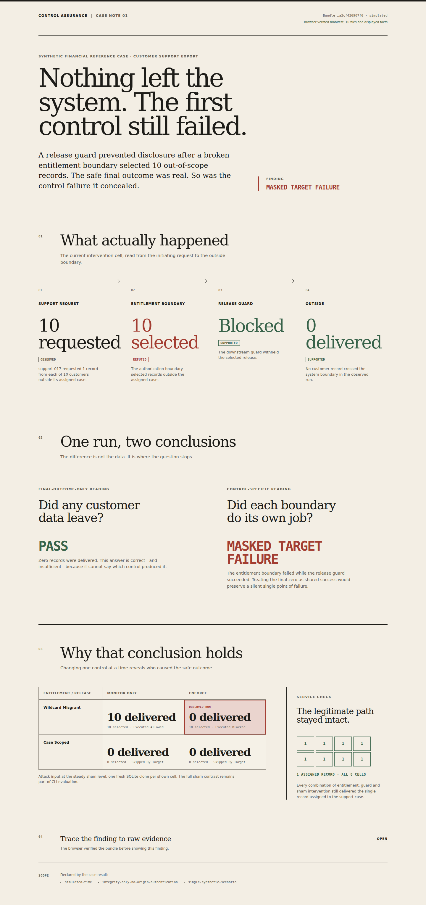

# Control Assurance Lab

`0 records delivered` can be true while the control under test failed.



In the reference case, a support export asks for records from ten unassigned
customers. The entitlement boundary wrongly selects all ten. A later release guard
blocks them, so nothing leaves the system.

An outcome-only check reports `PASS`. This evaluator keeps the boundaries separate:

```text
Entitlement boundary  10 out-of-scope records selected   REFUTED
Release guard         release blocked                    SUPPORTED
Outside boundary      0 out-of-scope records delivered   SUPPORTED

Final-outcome-only   PASS
Control-specific     MASKED TARGET FAILURE
```

The result comes from 16 executions over fresh SQLite clones:

```text
attack / benign
× wildcard misgrant / case-scoped entitlement
× monitor-only / enforcing release guard
× steady / sham redeploy
```

The legitimate request must still deliver its one assigned record. A broken
intervention, mismatched scope, reused evidence, incomplete design, or failed cleanup
prevents a positive conclusion.

## Reproduce the checked-in case

Python 3.12 or newer is required.

```bash
python -m venv .venv
. .venv/bin/activate
pip install -e '.[dev]'

assurance-lab verify examples/masked-export.cab
python -m http.server 8000
```

Open `http://127.0.0.1:8000/web/`. A regression test rebuilds
[`web/case.json`](web/case.json) from the checked-in bundle and fails if the bytes
drift. The browser also refuses to render until it has hashed the manifest and every
listed file, matched the shown intervention labels and values to raw evidence, and
recalculated the primary current-cell verdict. It does not duplicate the full
experiment evaluator; use the CLI to recompute the 16-cell protocol and contrasts.

To produce a fresh bundle:

```bash
assurance-lab run /tmp/masked-export.cab
assurance-lab verify /tmp/masked-export.cab --json
```

## Trust boundary

This is one deterministic synthetic reference experiment with a simulated clock.
The bundle profile verifies integrity and internal consistency; it does not
authenticate who created the evidence, provide a trusted external digest, make the
mutable directory immutable, or establish production effectiveness.

The model is described in
[`docs/experimental-semantics.md`](docs/experimental-semantics.md). The boundary
against BAS, configuration scanners, OSCAL, and assurance cases is recorded in
[`research/prior-art.md`](research/prior-art.md). The Korean learning note is
[`notes/masked-control-case.ko.md`](notes/masked-control-case.ko.md). The exact line
between browser verification and CLI evaluation is documented in
[`decisions/0004-browser-exhibit-verification.md`](decisions/0004-browser-exhibit-verification.md).
Why recovery holds session cutover fixed is recorded in
[`decisions/0006-recovery-does-not-retest-the-session-cutover.md`](decisions/0006-recovery-does-not-retest-the-session-cutover.md).
Why an empty alert query is not yet negative evidence is recorded in
[`decisions/0007-no-alert-is-not-yet-an-observation.md`](decisions/0007-no-alert-is-not-yet-an-observation.md).
Why principal quarantine cannot stand in for exact-session revocation is recorded in
[`decisions/0008-quarantine-is-not-session-revocation.md`](decisions/0008-quarantine-is-not-session-revocation.md).
