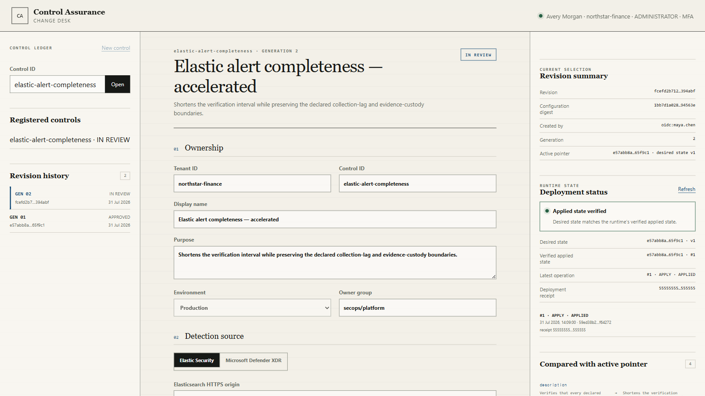

# Control Assurance Lab

[](https://github.com/gyubin02/control-assurance-lab/actions/workflows/checks.yml)
[](https://github.com/gyubin02/control-assurance-lab/releases/tag/v0.1.0)
[](LICENSE)

Control Assurance Lab identifies which security control failed—even when a
downstream safeguard kept the final outcome safe. v0.1.0 combines reproducible
matched-intervention experiments with an identity-bound evidence runtime and a
change-controlled web control plane.

> **Status:** alpha reference implementation. The included cases are synthetic.
> Production use requires institution-owned identity, PostgreSQL, KMS, WORM
> storage, network controls, and operational acceptance.



*The real v0.1.0 interface with synthetic operator data. Production access
requires SSO; no demo login is shipped.*

[Inspect the verified case](https://gyubin02.github.io/control-assurance-lab/web/)
· [Read the v0.1.0 release](https://github.com/gyubin02/control-assurance-lab/releases/tag/v0.1.0)
· [Review the pilot boundary](docs/financial-pilot-boundary.md)

## Why this exists

A support export requests records belonging to ten unassigned customers. The
entitlement boundary wrongly selects all ten. A release guard then blocks the
export, so no customer record leaves the system.

An outcome-only check sees a pass. The evidence says something more useful:

```text
Entitlement boundary  10 out-of-scope records selected   REFUTED
Release guard         release blocked                    SUPPORTED
Outside boundary      0 out-of-scope records delivered   SUPPORTED

Final-outcome-only   PASS
Control-specific     MASKED TARGET FAILURE
```


The finding is recomputed from 16 executions on fresh SQLite clones. A full
factorial matrix varies the request, entitlement, release guard, and redeploy
behavior, then recomputes matched contrasts while retaining a benign request as
a service check. Missing evidence, reused lineage, failed cleanup, or a
mismatched intervention prevents a positive conclusion.

## Start with the checked-in evidence

Python 3.12.x is required. The upper bound is intentional: the locked
environment and release image are not qualified on Python 3.13.

```bash
git clone --branch v0.1.0 --depth 1 \
  https://github.com/gyubin02/control-assurance-lab.git
cd control-assurance-lab

python3.12 -m venv .venv
. .venv/bin/activate
python -m pip install \
  --only-binary=:all: --require-hashes -r requirements/ci.lock
python -m pip install --no-deps --no-build-isolation .

assurance-lab verify examples/masked-export.cab
```

The last command should end with:

```text
Final-outcome-only   PASS
Control-specific     MASKED TARGET FAILURE
Evidence             cab:sha256:a0d192d2...02725136c4a3
Scope                synthetic · simulated clock · integrity-only
```

Rebuild the case from a fresh set of clones:

```bash
assurance-lab run /tmp/masked-export.cab
assurance-lab verify /tmp/masked-export.cab --json
```

Signature policy and sealed evidence bytes are separate decisions:

```bash
assurance-lab dsse verify \
  --envelope examples/dsse-v1/envelope.json \
  --policy examples/dsse-v1/trust-policy.json \
  --payload examples/dsse-v1/payload.json \
  --payload-type application/json \
  --at 2026-07-29T12:00:00Z

assurance-lab cab snapshot create examples/masked-export.cab \
  --out /tmp/masked-export.cabsnap
assurance-lab cab snapshot verify /tmp/masked-export.cabsnap
```

The dependency-free Node verifier supplies a second integrity implementation:

```bash
npm test --prefix verifier-js
npm run --prefix verifier-js verify:example
```

It verifies the generic CAB integrity profile, not arbitrary experiment
semantics. The fixed lifecycle benchmark has a separate Node evaluator:

```bash
assurance-lab benchmark release build /tmp/financial-control-lifecycle-v1
assurance-lab benchmark release verify /tmp/financial-control-lifecycle-v1
```

That build runs three synthetic scenarios, 16 factorial cells per scenario,
and three exact replicates per cell: 144 executions. It also replays the frozen
C01–C20 corruption corpus and requires the Python and Node evaluators to agree.
v0.1.0 does not include a precomputed benchmark result; the command creates a
local, content-closed result.

## What ships in v0.1.0

| Surface | Implemented boundary |
|---|---|
| Control experiments | Matched interventions, benign-service checks, raw receipts, and prevention/detection/response/recovery lifecycle invariants |
| Evidence and admission | Bounded CAB verification, DSSE trust policy, one-time leases, sealed snapshots, replay state, signed receipts, and custody acknowledgements |
| Change desk | Entra OIDC/PKCE, tenant roles, immutable revisions, fresh-MFA maker/checker rules, audit chaining, and separate desired/applied state |
| Runtime | Elastic Security and Defender XDR source composition, short-lived credential paths, separated journals, streaming evidence closure, and independent Node capture verification |
| Delivery | PostgreSQL 17 integration, leased and fenced reconciliation, idempotent runtime receipts, immutable Kubernetes rendering, and a signed, attested multi-platform container release |

The installed package exposes four entry points:

```text
assurance-lab
assurance-control-plane
assurance-deployment-reconciler
assurance-runtime-worker
```

The browser control plane is served at `/control/`. It has no development-login
fallback. Entra group entitlements map to bounded application roles:

| Role | Effective action |
|---|---|
| `viewer` | Read controls, revisions, desired state, applied state, and operations |
| `editor` | Create drafts and submit their own revisions |
| `approver` | Approve or reject another person's submitted revision |
| `deployer` | Activate, retry, or roll back another person's approved revision |
| `auditor` | Read and verify the append-only audit chain |
| `administrator` | Satisfy role checks, but not bypass maker/checker rules |

Approval and deployment require MFA from an authentication no more than one
hour old. An author cannot approve, activate, retry, or roll back their own
change.

## Architecture

```text
Entra OIDC operator
        │
        ▼
change desk ── desired revision + durable outbox ──> PostgreSQL
                                                        │
                                             deployment reconciler
                                                        │
                                             applied receipt + catalog
                                                        │
                                                scheduler / worker
                                                ╱                 ╲
                                      Elastic Security      Defender XDR
                                                ╲                 ╱
                                      raw source + operation receipts
                                                        │
                                           CAB stream snapshot
                                            ╱              ╲
                          Python + independent Node     signed custody closure
                                verification                     │
                                                       S3 Object Lock

Separate offline admission path:
DSSE envelope + trust policy + one-time lease
        └──> admission receipt + custody acknowledgement
```

The control plane can select desired state but cannot write the runtime catalog.
Reconcilers claim operations with an expiring lease and increasing fence. The
runtime target uses the immutable operation ID as an idempotency key and returns
an exact receipt. A retry after an ambiguous network outcome may repeat a call;
the design does not claim exactly-once network delivery.

Elastic uses a bounded just-in-time API-key path. Defender uses workload
identity and a tenant-bound token journal. Neither connector receives a static
credential through the evidence model. Runtime identity, configuration,
source request, signing, and custody selections are fixed before collection
begins.

## What the repository proves—and what it does not

| Checked here | Still owned by a deployment |
|---|---|
| Synthetic case conclusions recomputed from raw receipts | Effectiveness in a live financial network |
| Replica races and recovery tested against PostgreSQL 17 | Database HA, backups, partitions, and site SLOs |
| Hermetic Elastic/Defender connector tests and opt-in live conformance harnesses | Live tenant permissions, retention, and on-call reconciliation |
| Entra, Vault, Key Vault, AWS workload identity, and S3 Object Lock adapters | Institution identities, key ceremonies, cloud policy, and external anchoring |
| Immutable image/config rendering and a default-deny egress contract | Live Cilium, perimeter firewall, DNS, and cluster-admission enforcement |
| Digest signing and GitHub build provenance | Consumer-side digest admission and deployment approval |

A valid bundle digest establishes integrity. A valid signature can establish an
authorized signer under one policy. Neither alone proves freshness, consumes a
job lease, writes immutable custody, or proves that a production control is
effective.

This repository contains no live attack target or customer data. Passing its
cases is not evidence of regulatory compliance. The generic Node CAB program
checks integrity only; it is not a general independent semantic evaluator for
arbitrary experiment profiles.

## Container release

The `v0.1.0` tag publishes the same source as a non-root `linux/amd64` and
`linux/arm64` image:

```bash
docker pull ghcr.io/gyubin02/control-assurance-lab:0.1.0
docker run --rm ghcr.io/gyubin02/control-assurance-lab:0.1.0 \
  assurance-lab --version
```

The version tag is for discovery, not production admission. Pin the immutable
index digest from the GitHub Release and verify its Cosign identity and GitHub
attestation by following the
[consumer verification contract](deploy/container/README.md).

## Operate the implemented paths

- [Control-plane deployment, OIDC, database roles, and network release](docs/control-plane-deployment.md)
- [Deployment reconciliation and desired/applied semantics](docs/deployment-reconciliation.md)
- [Runtime worker deployment and recovery](docs/runtime-worker-deployment.md)
- [Runtime catalog, scheduling, and PostgreSQL privileges](docs/runtime-catalog-and-scheduling.md)
- [Elastic Security live conformance](docs/elastic-security-live-conformance.md)
- [Defender XDR operations and live conformance](docs/defender-xdr-live-conformance.md)
- [Evidence admission and custody](docs/admission-operations.md)
- [S3 Object Lock custody](docs/s3-object-lock-operations.md)
- [Vault Transit signing](docs/vault-transit-operations.md)
- [Azure workload identity and Key Vault](docs/azure-workload-identity.md)
- [Publishing recovery and identity-bound adoption](docs/publishing-recovery-runbook.md)

## Development

```bash
.venv/bin/ruff check .
.venv/bin/mypy src tests
.venv/bin/pytest
npm test --prefix verifier-js
node --test web/app.test.js
node --test src/assurance_lab/control_plane/static/model.test.mjs
```

CI uses hash-locked Python dependencies and commit-pinned GitHub Actions. It
also rebuilds `web/case.json` from the checked-in CAB so a stale derived page
cannot quietly replace the evidence. The case image above is regenerated from
that verified browser state with `scripts/capture-readme-hero.mjs`; the control
plane image uses synthetic data and the production UI assets.

See [CONTRIBUTING.md](CONTRIBUTING.md) for focused contribution paths and
[SECURITY.md](SECURITY.md) for private vulnerability reporting.

Apache-2.0 licensed.
