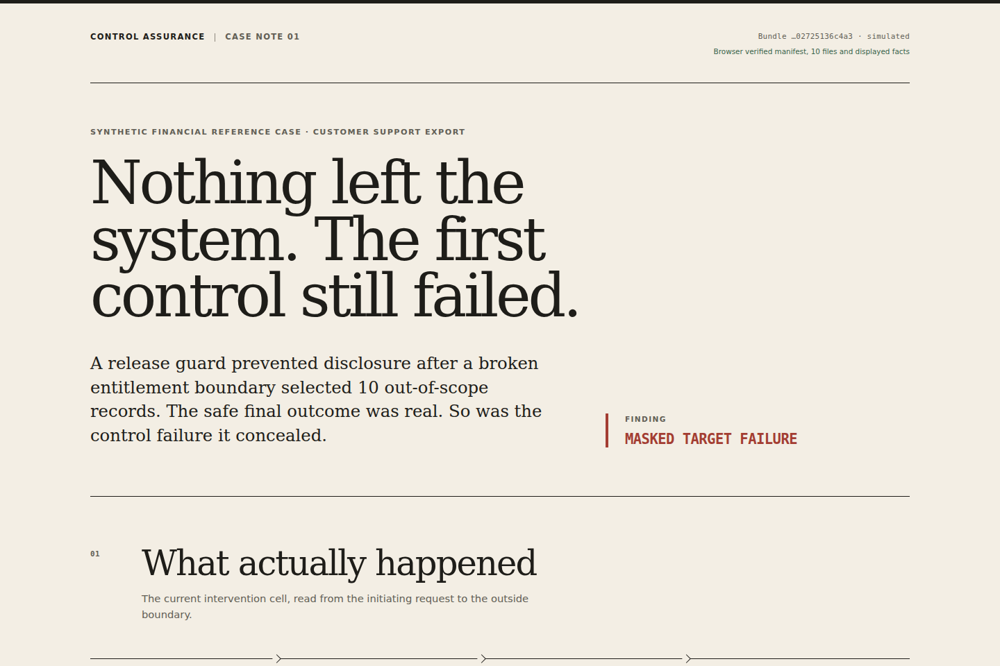

# Control Assurance Lab

A green outcome can hide a broken security control.

Control Assurance Lab runs matched interventions and keeps enough raw evidence
to recompute which control succeeded, which one failed, and whether a later
safeguard merely covered the failure.



## The first case

A support export requests records belonging to ten unassigned customers. The
entitlement boundary wrongly selects all ten. A release guard then blocks the
export, so no customer record leaves the system.

An outcome-only check is right about the ending and wrong about the control:

```text
Entitlement boundary  10 out-of-scope records selected   REFUTED
Release guard         release blocked                    SUPPORTED
Outside boundary      0 out-of-scope records delivered   SUPPORTED

Final-outcome-only   PASS
Control-specific     MASKED TARGET FAILURE
```

That conclusion is recomputed from 16 executions on fresh SQLite clones:

```text
attack / benign
× wildcard misgrant / case-scoped entitlement
× monitor-only / enforcing release guard
× steady / sham redeploy
```

The assigned-customer request must still work in every relevant cell. Missing
evidence, reused trial lineage, a failed cleanup, or a mismatched intervention
prevents a positive conclusion.

## Run it

Python 3.12.x is required. The upper bound is intentional: the locked
environment and release image are not qualified on Python 3.13 yet.

```bash
git clone https://github.com/gyubin02/control-assurance-lab.git
cd control-assurance-lab
python -m venv .venv
. .venv/bin/activate
python -m pip install \
  --only-binary=:all: --require-hashes -r requirements/ci.lock
python -m pip install --no-deps --no-build-isolation -e .

assurance-lab verify examples/masked-export.cab
```

To reproduce the case from a fresh set of clones:

```bash
assurance-lab run /tmp/masked-export.cab
assurance-lab verify /tmp/masked-export.cab --json
```

The signature decision and the sealed evidence bytes are deliberately separate
operations. Both can be exercised without a service or network:

```bash
assurance-lab dsse verify \
  --envelope examples/dsse-v1/envelope.json \
  --policy examples/dsse-v1/trust-policy.json \
  --payload examples/dsse-v1/payload.json \
  --payload-type application/json \
  --at 2026-07-29T12:00:00Z

assurance-lab cab snapshot create examples/masked-export.cab \
  --out /tmp/masked-export.cabsnap
assurance-lab cab snapshot verify /tmp/masked-export.cabsnap
```

The single-node reference admission boundary also has an operational CLI:

```bash
assurance-lab admission config validate --config /srv/assurance-lab/admission.json
assurance-lab admission policy install --config /srv/assurance-lab/admission.json \
  --policy /secure-transfer/collector-policy.json --revision 1
assurance-lab admission lease register --config /srv/assurance-lab/admission.json \
  --grant /secure-transfer/job-0001.signed-lease.json
assurance-lab admission bundle admit --config /srv/assurance-lab/admission.json \
  --envelope /secure-transfer/job-0001.dsse.json --cab /secure-transfer/job-0001.cab
```

Keys, password files, permissions, exact retry, and interrupted-custody recovery
are covered in
[`docs/admission-operations.md`](docs/admission-operations.md).

The static case note is also derived from the checked-in bundle:

```bash
python -m http.server 8000
```

Open `http://127.0.0.1:8000/web/`. The page hashes the manifest and every listed
file before rendering. It reconstructs the displayed cell, intervention labels,
and raw values in the browser. It is not a second implementation of the complete
experiment evaluator; the CLI remains the semantic verifier.

The dependency-free Node verifier provides a separate integrity implementation:

```bash
cd verifier-js
npm test
npm run verify:example
```

That command checks the generic CAB integrity profile; it does not evaluate a
scenario. The public lifecycle benchmark has a different Node implementation
that recomputes its fixed semantics from raw records:

```bash
assurance-lab benchmark release build /tmp/financial-control-lifecycle-v1
assurance-lab benchmark release verify /tmp/financial-control-lifecycle-v1
```

The builder runs three synthetic scenarios, 16 factorial cells per scenario,
and three exact replicates per cell: 144 executions in total. It also builds
and replays the frozen C01–C20 corruption corpus. The Python producer/verifier
and the dependency-free Node semantic verifier must agree before the release
directory is accepted. No benchmark directory or tagged benchmark artifact is
published from this repository today; the command above creates a local,
content-closed result.

## Production control path

The web control plane records approved desired state and a deployment outbox;
it does not receive runtime-catalog write permission. Two deployment
reconcilers may run at once. PostgreSQL claims one operation with compare-and-
swap, `FOR UPDATE SKIP LOCKED`, an expiring lease, and a monotonically
increasing fence before an adapter is called. Therefore two healthy replicas
racing for the same pending operation begin one adapter call.

A crash after the target commits is different: the reclaimed operation can
call the adapter again with the same operation ID and a higher fence. The
runtime target keeps that ID as its idempotency key, observes an existing exact
receipt instead of making a second logical change, and rejects stale lower
fences. This is not a claim of exactly-once network delivery.

The checked-in workload YAML is deliberately undeployable: application and
Vault images carry recognizable placeholder digests. The release renderer
replaces them with approved immutable images, binds every rendered manifest
and its source into one externally pinned lock digest, and rejects any later
file or image drift. The rendered set also starts from namespace-wide
default-deny network policy. A mandatory release-bound site contract generates
exact DNS-query and FQDN/port Cilium policy plus a static CIDR routing envelope
through at least two explicit egress gateways. The site perimeter must allow
those gateway sources only to contracted CIDRs and block all direct external
pod/node egress. The v3 contract pins the exact pod/node source CIDRs, the
allow-before-deny rule order, and an explicitly IPv4-only deployment boundary;
it does not pretend to prove the live firewall.

The production bootstrap, Kubernetes boundary, migration principal, OIDC/Key
Vault preflight, runtime-release gate, and failure procedures are in
[`docs/control-plane-deployment.md`](docs/control-plane-deployment.md).
The separate maker/checker procedure for adopting an identity-bound
publication is in
[`docs/publishing-recovery-runbook.md`](docs/publishing-recovery-runbook.md).

The browser control plane is served at `/control/` and has no development-login
fallback. Entra group entitlements produce bounded application roles:

| Role | Effective action |
|---|---|
| `viewer` | Read controls, revisions, desired state, applied state, and deployment operations |
| `editor` | Create drafts and submit their own revisions |
| `approver` | Approve or reject another person's submitted revision |
| `deployer` | Activate, retry, or roll back another person's approved revision |
| `auditor` | Read and verify the append-only audit chain |
| `administrator` | Satisfy role checks, but not bypass maker/checker rules |

Approval and deployment require MFA from an authentication no more than one
hour old. A revision author cannot approve, activate, retry, or roll back their
own change. The UI shows desired state separately from the latest operation
that the runtime target actually accepted; an approved request is not presented
as an applied deployment.

## What is here today

| Surface | Current boundary |
|---|---|
| Preventive reference case | Deterministic synthetic 16-cell experiment; recomputed from raw SQLite and operation receipts |
| CAB integrity | Bounded Python verifier, independent streaming Node verifier, and a browser check for displayed facts |
| Signer decision | Fail-closed DSSE profile with an external Ed25519 trust policy, threshold rules, key validity, and bounded inputs |
| Admission and custody | Single-node reference implementation for one-time leases, sealed CAB snapshots, replay state, signed receipts, and custody acknowledgements |
| Incident lifecycle | Synthetic response and recovery paths with monotone disclosure history and exact-session cutover evidence; library surface, not a general CLI |
| Public benchmark | Local release builder for 3 scenarios × 16 cells × 3 replicates, C01–C20 corruption replay, and independent Node semantic recomputation; no tagged result is published |

The larger service path is production-shaped, but its checked-in tests stop at
explicit boundaries:

| Component | Implemented and exercised here | Boundary still owned by a deployment |
|---|---|---|
| Control plane | Entra OIDC/PKCE, tenant RBAC, fresh-MFA maker/checker workflow, desired/applied separation, PostgreSQL role tests | Institution IdP, ingress, certificates, and operator access review |
| Deployment reconciler and catalog | Durable outbox leases, fences, idempotent runtime receipts, immutable profiles, PostgreSQL 17 integration | Database HA, network partitions, backups, and site SLO |
| Runtime worker | Elastic Security or Defender XDR source composition, separated journals, fenced publication, evidence closure | Live tenant permissions, retention policy, on-call reconciliation |
| Key and custody adapters | Azure Key Vault, Vault Transit, AWS workload identity, and S3 Object Lock contracts | Institution-owned cloud resources, key ceremonies, WORM policy, and external anchor |
| Kubernetes boundary | Immutable release rendering, exact image/config bindings, default-deny plus site egress contract | Live Cilium/firewall enforcement and cluster admission evidence |
| Container release | Non-root image contract and a scan-before-publish, digest-signing workflow | A published tag and consumer acceptance decision |

The distinction between those rows matters. A valid bundle digest establishes
integrity. A valid signature can establish an authorized signer under one policy.
Neither fact alone proves freshness, consumes a job lease, writes immutable
custody, or demonstrates that a production control is effective.

```text
raw receipts ──> CAB integrity ──> scenario recomputation
                    │
                    ├── independent Node integrity check
                    └── browser reconstruction of displayed facts

DSSE envelope + external policy + one-time lease
                    │
                    └── admission receipt + custody acknowledgement
```

## What it does not claim

This repository is not itself a deployed production service and contains no
live attack target or customer data. Its connector, SSO, PAM, KMS, custody, and
high-availability paths are hardened reference implementations; a real
deployment still needs site-owned identities, endpoints, policy overlays,
managed HA/WORM services, and an external transparency anchor. The generic
Node CAB program checks integrity only. The fixed lifecycle benchmark has its
own Node semantic evaluator, but there is not yet a general independent
semantic evaluator for arbitrary experiment profiles.

Passing the synthetic cases is not evidence of regulatory compliance or of
effectiveness in an operating financial network. The proposed path to a
read-only, isolated financial-sector pilot—and the conditions that stop such a
pilot—is documented in
[`docs/financial-pilot-boundary.md`](docs/financial-pilot-boundary.md).

## Operate the implemented paths

- [Control-plane deployment, OIDC, database roles, and network release](docs/control-plane-deployment.md)
- [Deployment reconciliation and desired/applied semantics](docs/deployment-reconciliation.md)
- [Runtime worker deployment and recovery boundary](docs/runtime-worker-deployment.md)
- [Runtime catalog, scheduling, and PostgreSQL privileges](docs/runtime-catalog-and-scheduling.md)
- [Elastic Security live conformance](docs/elastic-security-live-conformance.md)
- [Defender XDR operations and opt-in live conformance](docs/defender-xdr-live-conformance.md)
- [S3 Object Lock custody](docs/s3-object-lock-operations.md)
- [Vault Transit signing](docs/vault-transit-operations.md)
- [Azure workload identity and Key Vault operations](docs/azure-workload-identity.md)
- [Production container and consumer verification contract](deploy/container/README.md)

## Development

```bash
.venv/bin/ruff check .
.venv/bin/mypy src tests
.venv/bin/pytest
(cd verifier-js && npm test)
```

The CI workflow uses hash-locked Python dependencies and commit-pinned GitHub
Actions. A checked-in regression rebuilds `web/case.json` from the example CAB,
so a stale derived case cannot quietly replace the evidence. The image above is
a deterministic capture of that verified browser state; regenerate it with
`scripts/capture-readme-hero.mjs`.

Selected design notes:

- [Experimental semantics](docs/experimental-semantics.md)
- [Control Assurance DSSE Profile v1](docs/control-assurance-dsse-profile-v1.md)
- [Evidence bundle design](research/evidence-bundle-design.md)
- [Benchmark protocol](research/benchmark-protocol.md)
- [Why a valid signature is not an admission](decisions/0009-a-valid-signature-is-not-an-admission.md)
- [Why benchmark results are recomputed, not asserted](decisions/0010-benchmark-results-are-recomputed-not-asserted.md)

Apache-2.0 licensed.
